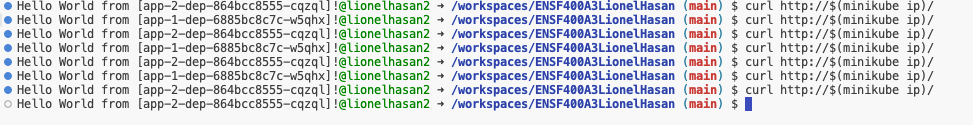
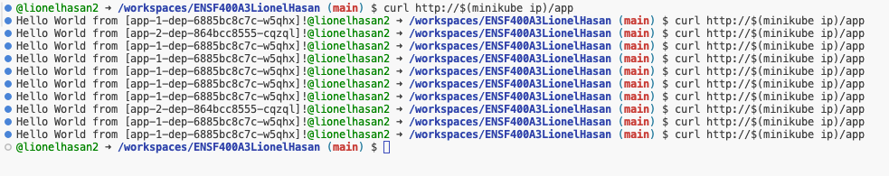

# ENSF400A3LionelHasan

# To properly run this lab, the following commands must be ran in order ideally:

1. minikube start
2. minikube addons enable ingress
3. kubectl apply -f nginx-configmap.yaml
4. kubectl apply -f nginx-dep.yaml
5. kubectl apply -f nginx-svc.yaml
6. kubectl apply -f nginx-ingress.yaml

7. kubectl apply -f app-1-dep.yaml
8. kubectl apply -f app-1-svc.yaml
9. kubectl apply -f app-1-ingress.yaml

10. kubectl apply -f app-2-dep.yaml
11. kubectl apply -f app-2-svc.yaml
12. kubectl apply -f app-2-ingress.yaml

# How Requirements are met

1. **Nginx-dep deployed with 5 replicas with version tag 1.14.2 and exposes port 80 :** All of these requirements are met inside the nginx-dep.yaml file.
2. **Config map with nginx cfg details mounted on nginx-dep**: The configmap with the nginx.cfg details can be found in the nginx-configmap.yaml file. The config map is mounted to the nginx configuration in the nginx-dep.yaml file. 
3. **Nginx Service selecting pods from nginx deployment**: Inside the nginx-svc file, the pods from the nginx deployment are selected and the service is exposed on port 80
4. **Nginx ingress file**: The nginx-ingress.yaml file redirects requests to the "/" path to the nginx-svc service.

The output for the nginx service can be seen below: 

5. **Write deployment and svc files for App-1 and App-2**: The deployment and service files can be seen in app-1-dep.yaml, app-1-svc.yaml, app-2-dep.yaml, app-2-svc.yaml 
6. **Ingress file to set up Canary deployment :** The app-1-ingress.yaml and app-2-ingress.yaml files will redirect 70% of the requests to /app to app-1 and 30% of the requests to 30% using a canary deployment. 

The output for the canary deployment can be seen below: 

